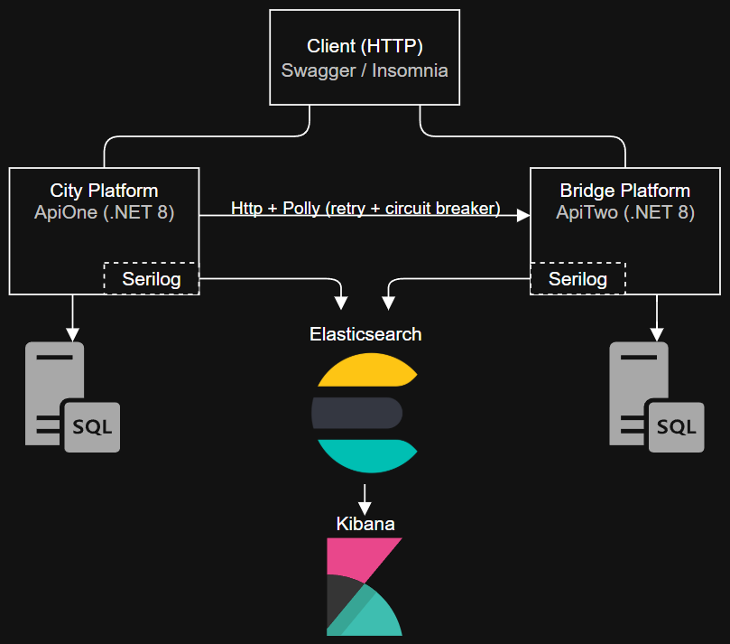

# Microservices Observability & Resilience Demo (.NET 8)

**TL;DR:** Two self‑contained .NET 8 microservices (**City** and **Bridge**) talk over HTTP, each persisting to its own SQL Server database. The domain is merely a placeholder; the spotlight is on **architecture & tooling**: DDD‑flavoured layers with a dash of CQRS, **Polly‑driven resilience (retry + circuit‑breaker)**, and full‑stack observability via **Serilog → Elasticsearch → Kibana**.  

**Spin it up with a single command:** `docker-compose up -d --build`

---

## Table of Contents

- [Short Version](#short-version)  
- [Full Documentation](#full-documentation)  
  - [1. Project Goal](#1-project-goal)  
  - [2. Architecture Overview](#2-architecture-overview)  
  - [3. Services & Responsibilities](#3-services--responsibilities)  
  - [4. Tech Stack & Patterns](#4-tech-stack--patterns)  
  - [5. Resilience (Polly)](#5-resilience-polly)  
  - [6. Observability](#6-observability)  
  - [7. Getting Started](#7-getting-started)  
  - [8. Project Structure](#8-project-structure)  
  - [9. Roadmap](#9-roadmap)  

---

## Short Version

- **What it is:** Portfolio project to demonstrate **communication, resilience, and observability** in a microservice scenario using .NET 8.  
- **Services:**
  - **ApiOne (City Platform)** — manages Cities  
  - **ApiTwo (Bridge Platform)** — manages Bridges  
  - **DatabaseOne** & **DatabaseTwo** — separate SQL Server DBs  
  - **Elasticsearch + Kibana** — centralized logging & dashboards
- **Communication:** HTTP only.  
- **Patterns:** DDD, simplified CQRS (kept inside the same project for simplicity).  
- **Resilience:** Polly retry + circuit breaker (open/closed/half-open).  
- **Observability:** Serilog → Elasticsearch → Kibana.  
- **Run locally:** `docker-compose up -d --build` (env vars already in code).  
- **Intentionally missing:** Auth, tests, caching, CI/CD.  
- **Next steps:** Eventual consistency via RabbitMQ + background worker.

---

## Full Documentation

### 1. Project Goal

This repository demonstrates **microservice practices and tooling** (resilience and observability). The business domain (Cities & Bridges) is merely a placeholder.

### 2. Architecture Overview

  

- Two independent .NET 8 APIs  
- Separate SQL Server databases  
- Logs shipped to Elasticsearch and visualized in Kibana  
- Docker Compose to orchestrate everything locally

### 3. Services & Responsibilities

| Service          | Tech            | Responsibility                    |
|------------------|-----------------|-----------------------------------|
| **ApiOne**       | .NET 8 / EF Core| CRUD for **City** entity          |
| **ApiTwo**       | .NET 8 / EF Core| CRUD for **Bridge** entity        |
| **DatabaseOne**  | SQL Server      | Cities DB                         |
| **DatabaseTwo**  | SQL Server      | Bridges DB                        |
| **Elasticsearch**| Elastic Stack   | Centralized log storage           |
| **Kibana**       | Elastic Stack   | Log exploration & dashboards      |

**Inter-service communication:** HTTP only.

### 4. Tech Stack & Patterns

- **Runtime / Lang:** .NET 8, C#  
- **Persistence:** SQL Server via Entity Framework Core  
- **Logging & Tracing:** Serilog → Elasticsearch/Kibana  
- **Resilience:** Polly (retry & circuit breaker)  
- **API Docs:** Swagger (per service)  
- **Architecture:**  
  - DDD layers: Presentation (Controllers), Application, Domain, Infra  
  - Simplified CQRS: commands/queries separated conceptually but in the same project  
  - Both APIs follow the same internal folder structure, kept in a single repo for easier maintenance

### 5. Resilience (Polly)

Outbound HTTP calls between services use Polly policies:

- **Retry** with exponential backoff  
- **Circuit Breaker** supporting Open → Half-open → Closed transitions

This showcases how to make cross-service calls robust against transient faults.

### 6. Observability

- **Serilog:** Structured logging with Elasticsearch sink  
- **Kibana:** Dashboards and Discover view for exploring logs per service, per level, etc.

Focus areas:
- Filtering logs by `service.name`  
- Correlating requests via trace/activity IDs  
- Visualizing error rates and retry/circuit-breaker events over time

### 7. Getting Started

#### Prerequisites
- Docker & Docker Compose installed

#### Run
```bash
docker-compose up -d --build
```

All required environment variables are already configured in code / compose.

#### Access
- **ApiOne Swagger**: http://localhost:8081/swagger
- **ApiTwo Swagger**: http://localhost:8082/swagger
- **Kibana**: http://localhost:5601

### 8. Project Structure
```
/ (repo root)
 ├─ docker-compose.yml
 ├─ README.md
 ├─ docs/
 │   ├─ system-design.drawio
 │   ├─ system-design.png
 │   ├─ er-diagram.drawio
 │   ├─ er-diagram.png
 ├─ ApiOne.Api/
 │   ├─ 1-Controllers/
 │   ├─ 2-Application/
 │   ├─ 3-Domain/
 │   ├─ 4-Infra/
 │   ├─ Program.cs
 │   ├─ appsettings.json
 │   ├─ appsettings.Development.json
 │   └─ Dockerfile
 └─ ApiTwo.Api/
     ├─ 1-Controllers/
     ├─ 2-Application/
     ├─ 3-Domain/
     ├─ 4-Infra/
     ├─ Program.cs
     ├─ appsettings.json
     ├─ appsettings.Development.json
     └─ Dockerfile
```

## 9. Roadmap

- **Eventual Consistency Demo**
  - Add a simplified `BridgeSummary` table inside ApiOne (City service).
  - Publish bridge changes from ApiTwo via RabbitMQ.
  - Background worker to consume messages and sync the read model.

- **Future Enhancements**
  - Authentication & authorization via my standalone Node.js Auth microservice  
    ([repo link](https://github.com/cainajuca/AuthGuardAPI)) – JWT + refresh tokens.
  - Caching and read/write DB separation.
  - More metrics with Prometheus/Grafana to complement ELK.